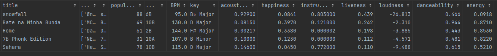

# Dataset for activity based music recommendation

Данный датасет используется для сформирования модели рекомендаций песен для сценария мероприятия или помещения.
Он состоит из некоторых свойств спарсанных из сайта [Tunebat](https://tunebat.com/). А также label — класс активности 
таргета, который определяется названиями плейлистов на yandex music.

## Источники 

### Tunebat
Сайт для анализа музыки, там представлены следующие характеристики: 
- Key -- тональность музыкального произведения
- BPM -- темп песни
- Popularity -- популярность определенная по прослушиваниям
- Energy -- энергичность, которая определяется тем насколько интенсивен и активен трек, в зависимости тембра, воспринимаемой громкости
- Danceability -- насколько трек подходит для танцев, исходя из общей регулярности, силы ударов, стабильности ритма и темпа
- Happiness -- жизнерадостность и позитивность трека
- Acousticness -- насколько вероятно, что трек акустический
- Instrumentalness -- насколько вероятно, что трек инструментальный
- Liveness -- насколько вероятно, что трек был записан вживую
- Speechiness -- несколько явно слова изобразятся в песне
- Loudness -- средняя амплитуда в децибелах по всей трассе в пределах от -60дБ до Odb.

### Yandex Music API
⚠️ Это неофициальная [библиотека](https://yandex-music.readthedocs.io/). Для паркинга песен, альбомов, плейлистов.

## Датасет

На данный момент, датасет состоит из 4 классов, в каждом из которых 20 записей. Пример записи: 

Простой EDA, представлен в [ноутбуке](main.ipynb) 